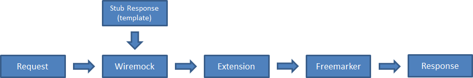

# wiremock-freemarker-extension

Wiremock Freemarker Extension is a [Wiremock](https://www.wiremock.org) extension that allows the use of the [Freemarker](https://freemarker.apache.org) template engine by using the stub body as a freemarker template and making the request available to be used in the template as variables (if the request is either a valid xml or json object, it will be parsed and the values may be referenced directly in the template).

## How to set it up
Wiremock can run both as a standalone mock server or as a unit test server instance, as explained in the [Wiremock documentation](https://www.wiremock.org/docs). 

In order to make the extension available for stub creation, the extension needs both to be available in the wiremock server classpath as well as having the server configured to be aware of the extension. Please refer to the official documentation for a more complete overview of how to use wiremock with extensions.

* **For Unit Tests**

  You need to include the wiremock freemarker extension as dependency of your project.
  
  Example dependencies in the pom.xml of a maven project
  ```xml
  <dependency>
      <groupId>com.github.tomakehurst</groupId>`
      <artifactId>wiremock</artifactId>
      <version>2.14.0</version>
      <scope>test</scope>
  </dependency>
  <dependency>
      <groupId>com.mindprogeny.wiremock.extension</groupId>
      <artifactId>wiremock-freemarker-extension</artifactId>
      <version>0.0.1</version>
      <scope>test</scope>
  </dependency>
  ``` 
  The extension was mainly developed for the standalone version of wiremock and as such includes all libraries required to run it on the standalone. The wiremock library includes some jackson libraries which are not available in the standalone version (since all dependencies are bundled in the same jar and the library packages are renamed to avoid conflicts), as such, using more recent versions of wiremock can potentially cause conflicts in dependencies. Check for dependency conflicts and solve them.

  To start up a Wiremock Server using a JUnit rule:
  ```java
             .
             .  
  import org.junit.Rule;
  import com.github.tomakehurst.wiremock.core.WireMockConfiguration;
  import com.github.tomakehurst.wiremock.junit.WireMockRule;
  import com.mindprogeny.wiremock.extension.freemarker.FreemarkerResponseTransformer;
             .
             .

  @Rule
  public WireMockRule wiremock = 
         new WireMockRule(WireMockConfiguration.wireMockConfig()
                                               .port(55080)
                                               .extensions(new FreemarkerResponseTransformer()));
  ```
  Where 55080 would be the port where the wiremock server would be listening.

* **For Standalone Wiremock**

  Download the standalone wiremock server (as explained in the [Wiremock documentation](https://www.wiremock.org/docs/running-standalone)) and the [wiremock freemarker extension](https://github.com/mindprogenitor/wiremock-freemarker-extension/releases).
 
  Run wiremock using the following minimal command (feel free to add any additional wiremock specific flags you need):
  ```sh
  java -cp "wiremock-standalone-2.14.0.jar:wiremock-freemarker-extension-0.0.1.jar" \
       com.github.tomakehurst.wiremock.standalone.WireMockServerRunner \
       --port 8080 --https-port 8443 \
       --extensions com.rabobank.cqc.wiremock.freemarker.extension.FreemarkerResponseTransformer
  ```
## How to use it
You may use wiremock as normal, except that you may define the body of your stub as a freemarker template, associate the stub with the freemarker extension and the extension will transform the stub body with freemarker before returning it to the requesting agent.

For example:
```java
wiremock.stubFor(get(urlEqualTo("/test"))
        .willReturn(aResponse().withStatus(200)
                               .withHeader("content-type", "application/xml")
                               .withBody("<root><date>${.now}</date></root>")
                               .withTransformers("freemarker-transformer")));
```
Or through the REST API:
```json
{
  "request": {
    "url": "/test",
    "method": "GET" },
  "response": {
    "status": 200,
    "body": "<root><date>${.now}</date></root>",
    "headers": {
    "Content-Type": "application/xml" },
    "transformers": ["freemarker-transformer"] }
}
```
Calls to endpoints configured with the extension will take the following steps:

 

1. Request for `/test` is received
2. Wiremock finds configured matching stub and identifies it as using the freemarker transformer.
3. The extension is called with the stubbed response as well as the received request
4. Extension parses the request and creates a request object to be used as a variable in the freemarker template.
5. Freemarker template is called using the stub body as the template and the request object as a variable.
6. Extension returns processed template as the response body.
7. Wiremock returns response to calling agent.

In this simple example, regardless of the request contents, the response is a simple xml object with a date tage containing the timestamp of the response generation.


